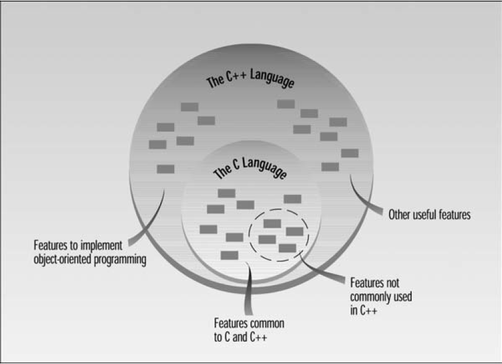

<h1 align="center"> Chapter 1: The Big Picture </h1>

#### In This Chapter

- [1.1 Why Do We Need OOP?](#11-why-do-we-need-oop)
- [1.2 Characteristics of Object-Oriented Languages](#12-characteristics-of-object-oriented-languages)
- [1.3 C++ and C](#13-c-and-c)
- [1.4 Laying the Groundwork](#14-laying-the-groundwork)
- [1.5 The Unified Modeling Language (UML)](#15-the-unified-modeling-language-uml)
- [Summarize in Points](#summarize-in-points)
- [Questions & Answers](#questions--answers)

## 1.1 Why Do We Need OOP?

For very small programs, the programmer creates the list of instructions, and the computer carries them out. (*Procedural Programming*)

*Functions* were adopted as a way to make programs more comprehensible to their human creators. *Functions* are list of instructions and we group many functions to build a program. group of functions called *module*.

Dividing a program into functions and modules is one of the cornerstones of *structured programming*

Analyzing the reasons for these failures reveals that there are weaknesses in the procedural paradigm itself. No matter how well the structured programming approach is implemented, large programs become excessively complex.

Procedural programming have two main problems:
- ***unrestricted Acess*** in procedural programming, data have two access types; global and local. In large programs we will need many connections between functions and data, this will cause some problems; first, the program structure will be diffuclt, second, the programg will be difficutl to modify; some change in global data can cause unwanted change in other functions. (Everything will be related to Everything)
- ***unrelated functions and data*** In the real world we deal with objects. objects aren’t data only or functions only. Complex real-world objects have both *attributes* and *behavior*. 
  - *attributes* object characteristics (equivalent to data).
  - *behaviour* object response and actions (equivalent to functions).

The Object-Oriented approach is to combine data and functions that operatoe on that data into a single unit called object.

## 1.2 Characteristics of Object-Oriented Languages

In object oriented programming you see the world as objects; you think of your program in terms of objects rather than functions such as; human entities, collections of data, componenents in a computer games, or physical objects.

> Object-Oriented Approch offer a revolution in program design.

In OOP we say that objects are members of classes, Classes are a blueprint of objects.

generating a sub-class from a class called inheritance such as veichle class have subclasses like trucks, buses, motorcycles.

One of the benefits of objects is that they give the programmer a convenient way to
construct new data types.

## 1.3 C++ and C

C++ is derived from the C language. Strictly speaking, it is a superset of C: Almost
every correct statement in C is also a correct statement in C++, although the reverse is
not true.

The most important elements added to C to create C++ concern classes, objects, and object-oriented programming. (C++ was originally called “C with classes.”)

 

## 1.4 Laying the Groundwork

Our goal is to help you begin writing OOP programs as soon as possible.

## 1.5 The Unified Modeling Language (UML)

The UML is a graphical “language” for modeling computer programs. “Modeling” means to create a simplified representation of something.

The UML provides a way to visualize the higher-level organization of programs without getting mired down in the details of actual code.

As we noted in the Introduction, we introduce specific features of the UML in stages throughout the book.
- Chapter 1: (this section) introduction to the UML
- Chapter 8: class diagrams, associations, and navigability
- Chapter 9: generalization, aggregation, and composition
- Chapter 10: state diagrams and multiplicity
- Chapter 11: object diagrams
- Chapter 13: more complex state diagrams
- Chapter 14: templates, dependencies, and stereotypes
- Chapter 16: use cases, use case diagrams, activity diagrams, and sequence diagrams

## Summarize in Points

- OOP is a way of organizing programs.
- OOP programs are organized around objects.
- Objects contain both data and functions.
- A class is a template for number of objects.
- The derived class inherit all data and functions from the parent class.
- Inheritance makes possible reusability.
- C++ is a superset of C.
- The Unified Modeling Language (UML) is a way to visualize a program’s structure.

## Questions & Answers

1. Pascal, BASIC, and C are **procedural** languages, while C++ is an **object oriented** programming language.
2. A widget is to the blueprint for a widget as an object is to **a class**
3. The two major components of an object are **data** and functions that **operate on that data**.
4. In C++, a function contained within a class is called **a member function**.
5. Protecting data from access by unauthorized functions is called **Data Hiding**.
6. Which of the following are good reasons to use an object-oriented language?
 **You can define your own data types and It’s easier to conceptualize an OO program.**
7. **Object** model entities in the real world more closely than do functions.
8. True or false: A C++ program is similar to a C program except for the details of coding. **False**
9. Bundling data and functions together is called **Encabsulation**.
10. When a language has the capability to produce new data types, it is said to be **extensible**.
11. True or false: You can easily tell, from any two lines of code, whether a program is written in C or C++. **False**
12. The ability of a function or operator to act in different ways on different data types is called **polymorphism**.
13. A normal C++ operator that acts in special ways on newly defined data types is
said to be **overloaded**.
14.  Memorizing the new terms used in C++ is **something you can return to later.**
15. The Unified Modeling Language is **a way to look at the organization of a program and helpful in developing software systems.**
