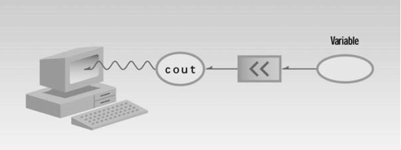
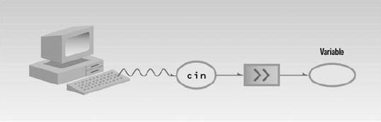
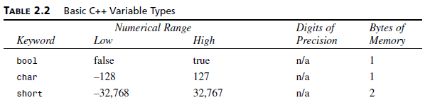
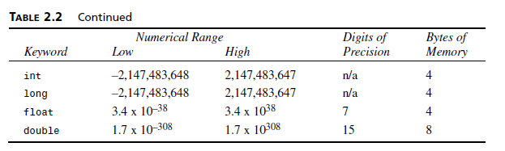
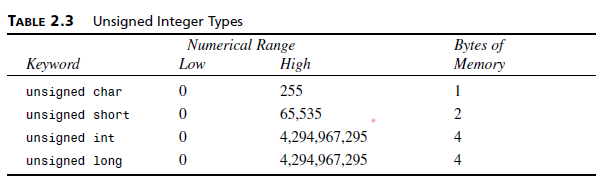
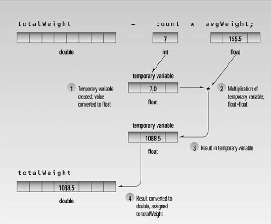
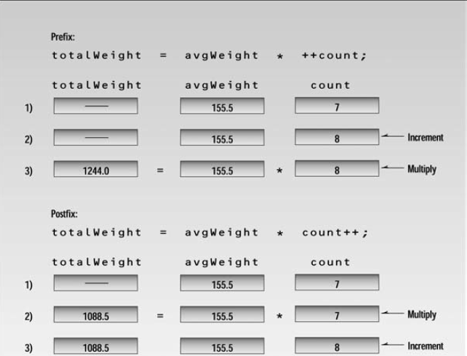

<h1 align="center"> Chapter 2: C++ Programming Basics </h1>

#### In This Chapter

- [2.1 Getting Started](#21-getting-started)
- [2.2 Basic Program Construction](#22-basic-program-construction)
- [2.3 Output using `cout`](#23-output-using-cout)
- [2.4 Directives](#24-directives)
- [2.5 Comments](#25-comments)
- [2.6 Integer Variables](#26-integer-variables)
- [2.7 Character Variables](#27-character-variables)
- [2.8 Input with `cin`](#28-input-with-cin)
- [2.9 Floating Point Types](#29-floating-point-types)
- [2.10 Type `bool`](#210-type-bool)
- [2.11 The `setw` Manipulator](#211-the-setw-manipulator)
- [2.12 Variable Type Summary](#212-variable-type-summary)
- [2.13 Type Conversion](#213-type-conversion)
- [2.14 Arithmetic Operators](#214-arithmetic-operators)
- [2.15 Library Functions](#215-library-functions)
- [Summarize in Points](#summarize-in-points)
- [Questions and Answers](#questions-and-answers)
- [Exercises and Solutions](#exercises-and-solutions)


## 2.1 Getting Started

Compilers take source code and transform it into executable file.

## 2.2 Basic Program Construction

This a a very simple program in C++.

```C++
#include <iostream>
using namespace std;

int main()
{
    cout << "Hello World" << endl ;
    return 0 ;
}
```

In this simple program there a single function called `main()`, When you run a C++ program the first statement executed will be at the beginning of a function called `main()`.

if there is no function called `main()` in your program, an error will be reported when you run the program.

We use the semicolon `;` after each line to tell the compiler to execute this instruction and without it C++ won't know when to execute this instruction.

## 2.3 Output using `cout`

`cout` is an object, it is predefined in C++ correspond to standart output stream to print something on the screen.

This operator `<<` is called *insertion* operator used to direct the contents of its right to the object on its left. shortly, it is used to display the information after it on the screen.

<p align="center"> </p>

The phrase in quotation marks, “Hello World”, is an example of a *string*. and it muyst exist between double quotation marks. you will use the *string* to print characters on the screen.

`endl` meaning *end line* in C++, and it is used to go to the next line or *escape sequence* in our programs.


## 2.4 Directives

the **first** line `#include<iostream>` is called a *preprocessor directive*, it is used to instruct the compiler, the compiler call this *preprocessor directives* in the beginening of the copmilation process. this type of directives must start with `#` sign.

`iostream` is an example of a header file. It’s concerned with basic input/output operations, and contains declarations that are needed by the `cout` identifier and the `<<` operator. Without these declarations, the compiler won't recognize `cout` and will think `<<` is being used incorrectly.

the **second** directive we used in this program is `using namespace std;`, we use the word namespace to recognize certain names nad if we didn't use the `using namespace std` for example, some statemnets like cout won't be recogonized untill you put `std::` before it such as

```C++
std::cout << "Hello World" << std::endl;
```

## 2.5 Comments

Comments are an important part of any program. They help the person writing a program, and anyone else who must read the source file, understand what’s going on. The compiler ignores comments, so they do not add to the file size or execution time of the executable program.

Comments start with a double slash symbol (//) and terminate at the end of the line.

```C++
#include <iostream>
using namespace std;
// This is a comment and the compiler will ignore the entire line completly

int main()
{
    cout << "Hello World" << endl ;
    return 0 ;
}
```

we use comments to clarify the big picture and reasone behind your code. So, we use it to:
1. explain the code to our team mates and what you are trying to do.
2. explain the code to ourselves in future when we forget about the logic behind this.

## 2.6 Integer Variables

When a variable is given a value, that value is actually placed in the memory space assigned to the variable.

Integer variables represent integer numbers like 1, 30,000, and –27. Such numbers are used for counting discrete numbers of objects, like 11 pencils or 99 bottles of beer.

an `int` occupies 4 bytes (which is 32 bits) of memory. This allows an int to hold numbers in the range from –2,147,483,648 to 2,147,483,647.

you must declare a variable before using it; this means to give the variable a data type.

```C++
int total ; // variable declaration
```

The names given to variables are called identifiers such as `total`.
What are the rules for writing identifiers? You can use upper- and lowercase letters, and the digits from 1 to 9. You can also use the underscore (_). The first character must be a letter or underscore. Identifiers can be as long as you like, but most compilers will only recognize the first few hundred characters. The compiler distinguishes between upper- and lowercase letters, so Var is not the same as var or VAR.

you can assign value to variables.

```C++
int total = 10 ; // variable assignment (variable initialization in some cases)
```
`cout` and the `<<` operator know how to treat an integer and a string differently. If we send them a *string*, they print it as text. If we send them an *integer*, they print it as a number.

```C++
#include <iostream>
using namespace std;

int main()
{   
    int var = 10 ; 
    cout << "var is " << var << endl ;
    return 0 ;
}
```

## 2.7 Character Variables

Type char stores integers that range in value from –128 to 127. Variables of this type occupy only 1 byte (eight bits) of memory. They are commonly used to store ASCII characters.

Character constants use single quotation marks around a character, like ‘a’ and ‘b’. (Note that this differs from string constants, which use double quotation marks.)


```C++
#include <iostream>
#include <string>
using namespace std;

int main()
{   
    char var1 = '-' ; // character variable with single quotation
    string var2 = "This is a string" ; // string variable with double quotation
    return 0 ;
}
```
escape sequence is a character that come after backslash `/` to interpret that character differently such as `/n`, `/t`, and `/a`.


## 2.8 Input with `cin`

```C++
#include <iostream>
using namespace std;
int main()
{
    int ftemp; // for temperature in fahrenheit
    cout << “Enter temperature in fahrenheit : “;
    cin >> ftemp;
    int ctemp = (ftemp - 32) * 5 / 9;
    cout << “Equivalent in Celsius is : “ << ctemp << ‘\n’;
    return 0;
}
```

the statement `cin` causes the program to wait for the user to enter a number (based on the variable type). the inserted number will be placed in the variabel `ftemp`.

<p align="center"> </p>

## 2.9 Floating Point Types

Floating-point variables represent numbers with a decimal place—like 3.1415927, 0.0000625, and –10.2.

Type float stores numbers in the range of about 3.4x10–38 to 3.4x1038, with a precision of seven digits. It occupies 4 bytes (32 bits) in memory.

```C++
int main()
{
    float rad;                           // variable of type float
    const float PI = 3.14159F;           // type const float
    cout << “Enter radius of circle : “; // prompt
    cin >> rad;                          // get radius
    float area = PI * rad * rad;         // find area
    cout << “Area is “ << area << endl;  // display answer
    return 0;
}
```

Type double requires 8 bytes of storage and handles numbers in the range from 1.7x10–308 to 1.7x10308 with a precision of 15 digits.

The *exponent* can be positive or negative. The exponential number 6.35239E–5 is equivalent to 0.0000635239 in decimal notation. This is the same as 6.35239 times 10–5. (*exponential notation*)

The keyword `const` (for constant) precedes the data type of a variable. It specifies that the value of a variable will not change throughout the program. Any attempt to alter the value of a variable defined with this qualifier will elicit an error message from the compiler.

## 2.10 Type `bool`

Variables of type bool can have only two possible values: true and false. In theory a bool type requires only one bit (not byte) of storage, but in practice compilers
often store them as bytes because a byte can be quickly accessed, while an individual bit must be extracted from a byte, which requires additional time.

> Type bool gets its name from *George Boole*, a 19th century English mathematician who invented the concept of using logical operators with true-or-false values. Thus such true/false values are often called Boolean values.

## 2.11 The `setw` Manipulator

We’ve mentioned that manipulators are operators used with the insertion operator (<<) to modify or manipulate the way data is displayed.

`setw` changes the field width of output.

```C++
// width2.cpp
// demonstrates setw manipulator
#include <iostream>
#include <iomanip> // for setw [Input Output Manipulator]
using namespace std;
int main()
{
    long pop1 = 2425785, pop2 = 47, pop3 = 9761;
    cout << setw(8) << "LOCATION" << setw(15)
         << "POPULATION" << endl
         << setw(8) << "Portcity" << setw(15) << pop1 << endl
         << setw(8) << "Hightown" << setw(15) << pop2 << endl
         << setw(8) << "Lowville" << setw(15) << pop3 << endl;
    return 0;
}
```
width2.cpp result
```
LOCATION     POPULATION
Portcity        2425785
Hightown             47
Lowville           9761
```

## 2.12 Variable Type Summary

<p align="center"> </p>

<p align="center"> </p>

<p align="center"> </p>

## 2.13 Type Conversion

 ```C++
 // mixed.cpp
// shows mixed expressions
#include <iostream>
using namespace std;
int main()
{
    int count = 7;
    float avgWeight = 155.5F;
    double totalWeight = count * avgWeight;
    cout << "totalWeight =" << totalWeight << endl;
    return 0;
}
```
result
```
totalWeight =1088.5
```

<p align="center"> </p>

*Casting* is to change data type manually. Here’s a statement that uses a C++ cast to change a variable of type int into a variable of type char:

```c++
aCharVar = char(anIntVar);
```

## 2.14 Arithmetic Operators

As you have probably gathered by this time, C++ uses the four normal arithmetic operators +, -, *, and / for addition, subtraction, multiplication, and division.

*Remainder operator* (%) works only with integer variables (types char, short, int, and long). This operator (also called the *modulus operator*) finds the remainder when one number is divided by another. The REMAIND program demonstrates the effect.


```C++
// remaind.cpp
// demonstrates remainder operator
#include <iostream>
using namespace std;
int main()
{
    cout << 6 % 8 << endl   // 6
         << 7 % 8 << endl   // 7
         << 8 % 8 << endl   // 0
         << 9 % 8 << endl   // 1
         << 10 % 8 << endl; // 2
    return 0;
}
```
C++ offers several ways to shorten and clarify your code. One of these is the arithmetic *assignment operator*.

```C++
// assign.cpp
// demonstrates arithmetic assignment operators
#include <iostream>
using namespace std;
int main()
{
    int ans = 27;
    ans += 10; // same as: ans = ans + 10;
    cout << ans << ", ";
    ans -= 7; // same as: ans = ans - 7;
    cout << ans << ", ";
    ans *= 2; // same as: ans = ans * 2;
    cout << ans << ", ";
    ans /= 3; // same as: ans = ans / 3;
    cout << ans << ", ";
    ans %= 3; // same as: ans = ans % 3;
    cout << ans << endl;
    return 0;
}

```
Here’s the output from this program : 

```
37, 30, 60, 20, 2
```
You don’t need to use arithmetic assignment operators in your code, but they are a common feature of the language; they’ll appear in numerous examples in this book.

Here’s an even more specialized operator. You often need to add 1 to the value of an existing variable.

```C++
int count = 0 ;
count++ ; // increase the count value by 1
```
Also, it can be used as *prefix* `++count` or *postfix* `count++`. Often a variable is incremented within a statement that performs some other operation on it. For example

```C++
totalWeight = avgWeight * ++count;
```
In this case count is incremented first. How do we know that? Because *prefix* notation is used: `++count`. If we had used *postfix* notation, `count++`, the multiplication would have been performed first, then count would have been incremented.

<p align="center"> </p>

```C++
// increm.cpp
// demonstrates the increment operator
#include <iostream>
using namespace std;
int main()
{
    int count = 10;
    cout << "count =" << count << endl;   // displays 10
    cout << "count =" << ++count << endl; // displays 11 (prefix)
    cout << "count =" << count << endl;   // displays 11
    cout << "count =" << count++ << endl; // displays 11 (postfix)
    cout << "count =" << count << endl;   // displays 12
    return 0;
}
```

The decrement operator, `--`, behaves very much like the increment operator, except that it subtracts 1 from its operand. It too can be used in both *prefix* and *postfix* forms.

## 2.15 Library Functions

Many activities in C++ are carried out by library functions. These functions perform file access, mathematical computations, and data conversion, among other things. Like `sqrt()` function that calculate square root of a number and it is included from the `<cmath>` library.

If you don’t include the appropriate header file when you use a library function, you’ll get an error message like this from the compiler: *‘sqrt’ unidentified identifier.*

## Summarize in Points

- We learned about the `main()` function.
- A function is acomposed of *statements*, every statement end with semicolon `;`.
- `cout` object and insertion `<<` operator to display information on the screen.
- `cin` object and extraction operator `>>` to assign some information from the user to a variable.
- *signed* and *unsigned* versions of different data types.
-  `const` variables will not the change while program is running.
-  arithmetic and arithmetic assignments operators.
-  the linked is used to link the library and header files with the object file and the result is an executable `.exe` file.

## Questions and Answers

1. Dividing a program into functions **makes the program easier to conceptualize and may reduce the size of the program.**
2. A function name must be followed by **parentheses**.
3. A function body is delimited by **curly brackets**.
4. Why is the main() function special? **Because it is the first function to be executed.**
5. A C++ instruction that tells the computer to do something is called a **statements**.
6. // This is a comment , /* old fashioned comment */.
7. An expression **usually evaluates to a numerical value and may be part of a statement.**
8. Specify how many bytes are occupied by the following data types in a 32-bit system: 
   1. int: **4 bytes**
   2. long double: **10 bytes** 
   3. float: **4 bytes**
   4. long: **4 bytes**
9. A variable of type char can hold the value 301. **False**
10. What kind of program elements are the following?
    1.  12: **int**
    2.  ‘a’: **char**
    3.  4.28915: **float**
    4.  JungleJim: **variable name**
    5.  JungleJim(): **function**
11. Write statements that display on the screen
    1.  the character ‘x’: `cout << 'x' ;`
    2.  the name Jim: `cout << "Jim" ;`
    3.  the number 509: `cout << 509 ;`
12. True or false: In an assignment statement, the value on the left of the equal sign is always equal to the value on the right. **False**
13. Write a statement that displays the variable *george* in a field 10 characters wide.
    1.  `cout << setw(10) << "george" ;`
14. What header file must you #include with your source file to use cout and cin? `#include <iostream>`
15. Write a statement that gets a numerical value from the keyboard and places it in the variable `temp`.
```C++
int temp= 0 ;
cin >> temp;
```
16. What header file must you #include with your program to use setw? `#include <iomanip>`.
17. Two exceptions to the rule that the compiler ignores whitespace are **string** and **preprocessor directives**.
18. True or false: It’s perfectly all right to use variables of different data types in the same arithmetic expression. **True**
19. The expression 11%3 evaluates to **2**.
20. An arithmetic assignment operator combines the effect of what two operators? **assignment (=) and arithmetic operation (*,/,+,-)**.
21. Write a statement that uses an arithmetic assignment operator to increase the value of the variable temp by 23. Write the same statement without the arithmetic assignment operator.
```C++
int temp = 0;
temp += 23 ;        // first solution
temp = temp + 23 ;  // second solution
```
22. The increment operator increases the value of a variable by how much? **by 1**
23. Assuming var1 starts with the value 20, what will the following code fragment print out?
```C++
cout << var1--; // 20
cout << ++var1; // 20
```
24. In the examples we’ve seen so far, header files have been used for what purpose? **to include library functions, overloaded operators, and objects**.
25. The actual code for library functions is contained in a **library** file.

## Exercises and Solutions

1. Assuming there are 7.481 gallons in a cubic foot, write a program that asks the user to enter a number of gallons, and then displays the equivalent in cubic feet. [solution](./exercises/gallons.cpp)
2. Write a program that generates the following table:
1990 135
1991 7290
1992 11300
1993 16200
Use a single cout statement for all output. [solution](exercises/table.cpp)
3. Write a program that generates the following output:
10
20
19
Use an integer constant for the 10, an arithmetic assignment operator to generate the 20, and a decrement operator to generate the 19. [solution](./exercises/arithmeticAssignment.cpp)
4. Write a program that displays your favorite poem. Use an appropriate escape sequence for the line breaks. If you don’t have a favorite poem, you can borrow this one by Ogden Nash:
Candy is dandy,
But liquor is quicker. [solution](./exercises/escapeOperator.cpp)
5. A library function, islower(), takes a single character (a letter) as an argument and returns a nonzero integer if the letter is lowercase, or zero if it is uppercase. This function requires the header file CTYPE.H. Write a program that allows the user to enter a letter, and then displays either zero or nonzero, depending on whether a lowercase or uppercase letter was entered. [solution](exercises/islower().cpp)
6. On a certain day the British pound was equivalent to $1.487 U.S., the French franc was $0.172, the German deutschemark was $0.584, and the Japanese yen was $0.00955. Write a program that allows the user to enter an amount in dollars, and then displays this value converted to these four other monetary units. [solution](exercises/convertDollars.cpp)
7. You can convert temperature from degrees Celsius to degrees Fahrenheit by multiplying by 9/5 and adding 32. Write a program that allows the user to enter a floating-point number representing degrees Celsius, and then displays the corresponding degrees Fahrenheit. [solution](exercises/fahrenheit.cpp)
8.  When a value is smaller than a field specified with setw(), the unused locations are, by default, filled in with spaces. The manipulator setfill() takes a single character as an argument and causes this character to be substituted for spaces in the empty parts of a field. Rewrite the WIDTH program so that the characters on each line between the location
name and the population number are filled in with periods instead of spaces, as in
Portcity.....2425785 [solution](exercises/setw.cpp)
9. If you have two fractions, a/b and c/d, their sum can be obtained from the formula: [solution](exercises/fractionsSum.cpp)
```
sum = (a*d + b*c) / (b*d)
```
10. In the heyday of the British empire, Great Britain used a monetary system based on pounds, shillings, and pence. There were 20 shillings to a pound, and 12 pence to a shilling. The notation for this old system used the pound sign, £, and two decimal points, so that, for example, £5.2.8 meant 5 pounds, 2 shillings, and 8 pence. (Pence is the plural of penny.) The new monetary system, introduced in the 1950s, consists of only pounds and pence, with 100 pence to a pound (like U.S. dollars and cents). We’ll call this new system decimal pounds. Thus £5.2.8 in the old notation is £5.13 in decimal pounds (actually £5.1333333). Write a program to convert the old pounds-shillings-pence format to decimal pounds. [solution](exercises/decimalPounds.cpp)
11. 