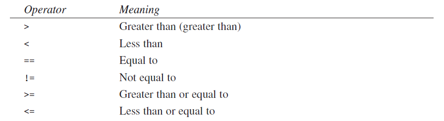
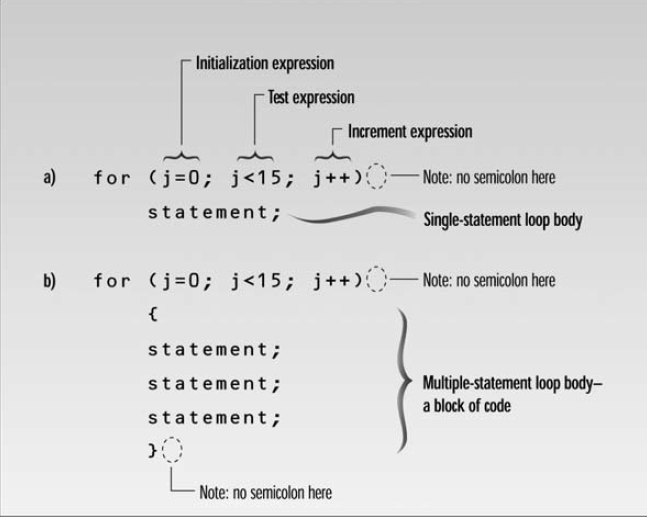
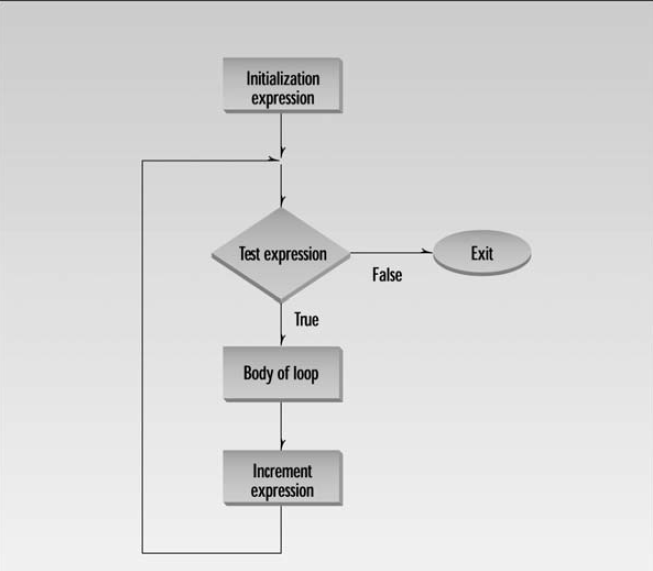

<h1 align="center"> Chapter 3: Loops and Decisions </h1>

#### In This Chapter

- [3.1 Relational Operators](#31-relational-operators)
- [3.2 Loops](#32-loops)
  - [3.2.1 The `for` Loop](#321-the-for-loop)
  - [3.2.1 The `while` Loop](#321-the-while-loop)


## 3.1 Relational Operators

A relational operator compares two values. The comparisoninvolves such relationships as equal to, less than, and greater than. The result of the comparison is true or false.

<p align="center"> </p>

## 3.2 Loops

Loops cause a section of your program to be repeated a certain number of times. There are three kinds of loops in C++: the for loop, the while loop, and the do loop.

### 3.2.1 The `for` Loop

The `for` loop have its loop control elements are gathered in one place.

```C++

// fordemo.cpp
// demonstrates simple FOR loop
#include <iostream>
using namespace std;
int main()
{
    int j;                    // define a loop variable
    for (j = 0; j < 15; j++)  // loop from 0 to 14,
        cout << j * j << " "; // displaying the square of j
    cout << endl;
    return 0;
}

// result  0 1 4 9 16 25 36 49 64 81 100 121 144 169 196
```
These three expressions are the initialization expression, the test expression, and the increment expression.

<p align="center"> </p>

The *initialization expression* is executed only once, when the loop first starts.

The *test expression* usually involves a relational operator. It is evaluated each time through the loop.

The *increment expression* changes the value of the loop variable, often by incrementing it. It is always executed at the end of the loop.

<p align="center"> </p>

You can put more than one expression in the initialization part of the for statement, separating the different expressions by commas. You can also have more than one increment expression. You can have only one test expression.

```cpp
for( j=0, alpha=100; j<50; j++, beta-- )
{
// body of loop
}
```

### 3.2.1 The `while` Loop

The next example, ENDON(), asks the user to enter a series of numbers. When the number entered is 0, the loop terminates. Notice that there’s no way for the program to know in advance how many numbers will be typed before the 0 appears; that’s up to the user.

```cpp
// endon0.cpp
// demonstrates WHILE loop
#include <iostream>
using namespace std;
int main()
{
    int n = 99;    // make sure n isn’t initialized to 0
    while (n != 0) // loop until n is 0
        cin >> n;  // read a number into n
    cout << endl;
    return 0;
}
```

